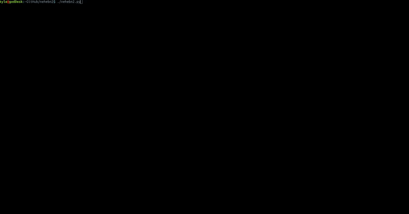

# Nehebn2
NEarlyHEadlessBinaryNinja(2)

The only thing better than completely headless.

---

(TL;DR at bottom)

A friend of mine threatened to use R2 so he wouldn't have to use a GUI, and on my honor as Binary Ninja in training (aka summer intern) I felt duty-bound to set out upon this mission... A couple weeks of my free time and roughly 800 lines of python3 later, we have this: a CLI for BinaryNinja: N2.

Though, any more of my free time would be kinda ridiculous for a private little gag, so I'm open sourcing N2...Most of the initial grunt-work is now complete, and we have:

 - Linear Disassembly View, with scroll up/down AND page up/down. WOW!
 - 6.5 xrefs! WOAH!
 - A scrollable list of functions, and the ability to jump to one at will, KAACHOW!!
 - Hex View with no visible horizontal cursor! Count me in!
 - A place holder for Control Flow Graphs! POW!
 - A main menu! Ding ding ding!
 - And _customizable key-bindings_ KABLAM!  
 (just go ahead and mentally render that like a comic book for me please)

Currently, if you didn't get this from the list above, N2 is seriously lacking... But I made sure to keep track and make a list of the most important things that need to be added, and if you're interested a quick `grep -r "# TODO..."` gives us:

```
# TODO...FIX the ugly main menu screen...seriously
# TODO...impliment 'GO TO' box
# TODO...maybe Separate each view into a class to make cleaning up the various view-dependent variables neater?
# TODO...impliment color themes with the new color theme format courtesy of peter
# TODO...impliment disassembly options
# TODO...impliment scroll bars on windows?, and the setting to disable them
# TODO...impliment the ability to edit what we're seeing.. Enter an insert mode in Hex view (or be in it by default like in BN proper), and have patches available in linear/cfg
# TODO...impliment the ability to cursor into linear assembly lines.
# TODO...impliment undo!  I think the API actually takes care of this for us nicely, but editing has to be implemented first and it'd be nice to snap the view back to whatever is being edited too
# TODO...make sure this is deleted in the view's cleanup
# TODO...make sure this is deleted in the view's cleanup
# TODO...Impliment Wrap Around
# TODO...Impliment Not Crashing On Moving Past Buffer
# TODO...impliment xrefs window up/down, cursor, and selection mechanics
# TODO...FIX...stop clipping
# TODO...FIX...will currently jump to the top of a block, also skips down in some cases?
# TODO...make this for loop at least reasonably efficient...it's seriously just a clusterfuck right now
# TODO...impliment parseInput_cfg_main
# TODO...FIX the lag induced by fetching the names of the functions (seems to take forever)
# TODO...Turn into function name's highlight instead, sift text back over to the left
# TODO...get and render xrefs in a more elegant manner
# TODO...Turn into a linear disassembly line highlight instead, shift text back over to the left
# TODO...impliment highlighting current position
# TODO...impliment render_cfg (still need to render actual graphs..)
# TODO...seperate views into different functions
# TODO...add some settings to the settings view
# TODO...impliment live-refreshing the settings.json during run (add the key-binding and check for it here in the global input loop)
# TODO...support multi-key presses? Not sure if this already works or not
```

As you can see, there is plenty left to do and I am eager to do them, but I want to know what you think!:



To be clear, this is built using the [BinaryNinjaAPI](github.com/Vector35/binaryninja-api) and python3.. As it stands as of July 1st, 2018, you'll need to use the `test_python3_unit` branch to build yourself the version of the API that works with python3...(I'll fix that as soon as I can figure out Vector35's build system and get the builds passing on all three platforms).  You also need to have a headless license to use this...though you might also be able to run it in the script console as well.

TL;DR:  
If you're interested in this thumbs up on [GitHub issue #1](github.com/KyleMiles/nehebn2/issues/1) and if there's enough interest I'll keep working on this rather than moving on to another project.  If you want to contribute, I'll be happy to accept reasonably well-done pull requests.

I hope you like what you see, and I hope you let me know so I can keep working on this...but until then, try to keep your head on straight!
